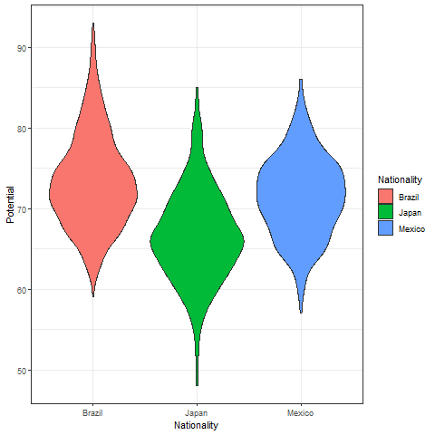
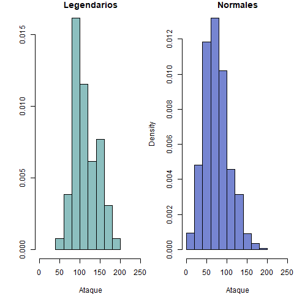
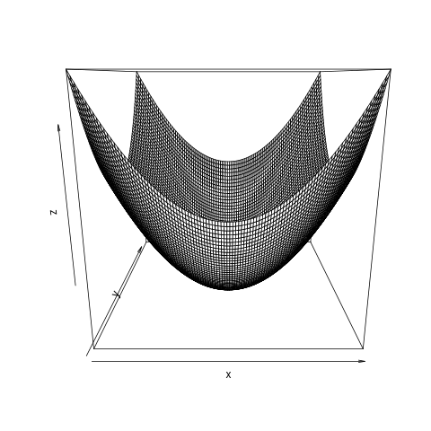
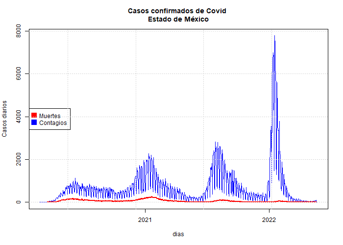
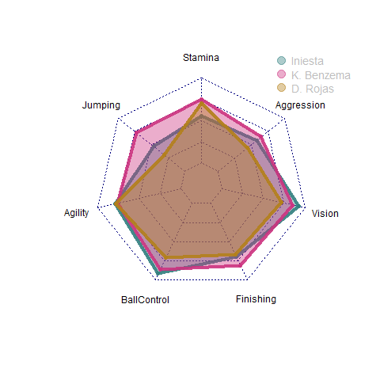
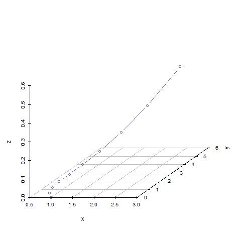
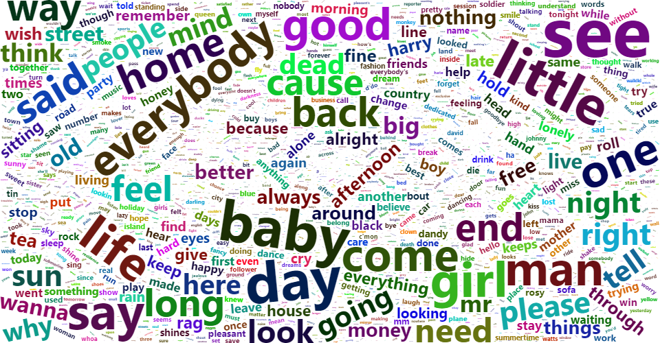
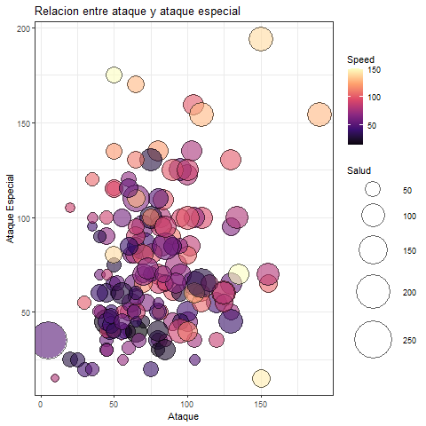

## Visualización de Datos con R

 

~~~~
 > una imagen dice mas que mil palabras
~~~~

## Preview

| Violin | Dispersión | Histograma |
|--------|----------|------|
||||

| Animaciones | Covid | Radar |
|--------|----------|------|
||||

| Evolución | WordCloud | Burbujas |
|--------|----------|------|
||||

