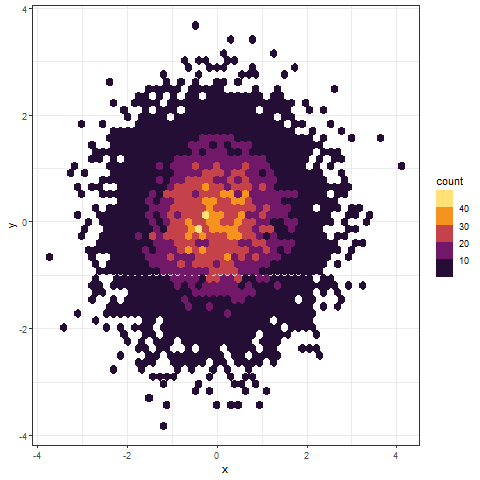

# Visualización de Datos con R
~~~~
 > una imagen dice mas que mil palabras
~~~~
## Galleria

| Violin | Dispersión | Histograma |
|--------|----------|------|
||||

| Animaciones | Covid | Radar |
|--------|----------|------|
||||

| Evolución | Densidad2d | Burbujas |
|--------|----------|------|
||||

## Paquetes
~~~~
> install.packeges("nombre_del_paquete")
~~~~
- [x]  **dplyr** : para la manipuacón de data frames
- [ ]  **ggplot2** un clasico dentro de R
- [ ]  **fmsb**: Graficos de Radar
- [ ]  **magick**: crear animaciones
- [ ]  **scatterplot3d**
- [ ]  **rshiny**
